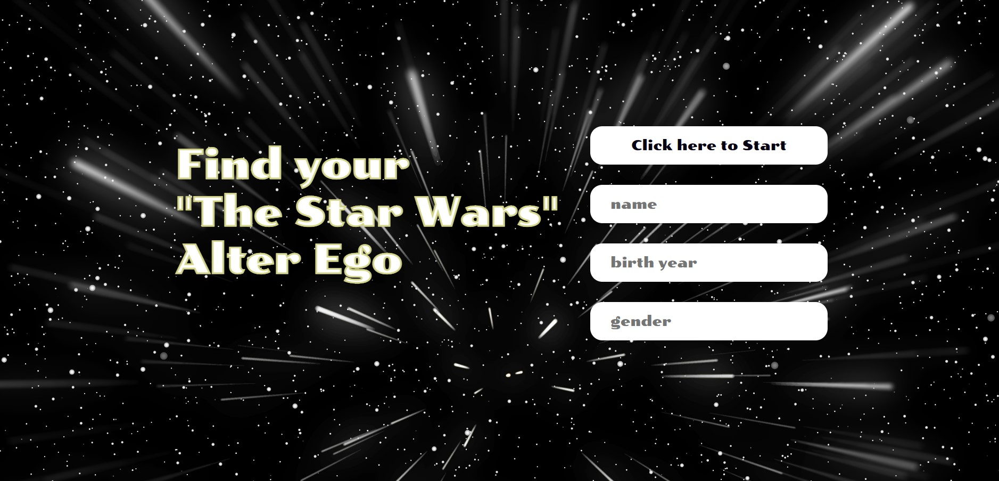

# Star Wars Game
This repository contains a JavaScript-based Star Wars game that utilizes an API to generate random Star Wars character information. The game is designed as a simple web application and can be easily run in any modern web browser.

## Preview

## Usage
1. You can access a live demo of the  Star Wars Game by visiting the GitHub Pages [link for the project](https://kgogina.github.io/api_fetch_game/). This allows you to use the application directly in your web browser without the need to clone or download the repository.
2. Click the "Click here to Start" button to generate a random Star Wars character.
3. The game will make an API request to retrieve information about the character.
4. Once the information is fetched, the character's name, birth year, and gender will be displayed in the respective input fields on the screen.
5. Enjoy finding your Star Wars alter ego!

## Features
- Generates random Star Wars character information using the Star Wars API.
- Provides the character's name, birth year, and gender.
- Simple and intuitive user interface.
- Responsive design for optimal viewing on various devices.

## Contributing
Contributions to the Star Wars game are welcome and encouraged! If you'd like to contribute, please follow these steps:

1. Fork the repository.
2. Create a new branch for your feature or bug fix.
3. Make your modifications and commit your changes.
4. Push your changes to your fork.
5. Submit a pull request.
